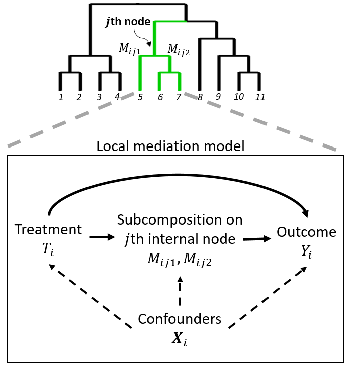

```{r, include = FALSE}
knitr::opts_chunk$set(
  warning=FALSE, message=FALSE,
  collapse = TRUE,
  fig.align = "center",
  prompt = TRUE,
  comment = ""
)
```

This is a practical tutorial on the use of `miMediation` package, which introduces a phylogeny-based mediation test (PhyloMed) for high-dimensional microbial composition mediators. The methodology is described in detail in the @hong2021phylomed.

## A brief summary of the PhyloMed

PhyloMed models microbiome mediation effect through a cascade of independent local mediation models of subcompositions on the internal nodes of the phylogenetic tree. Each local model captures the mediation effect of a subcomposition at a given taxonomic resolution. The method improves
the power of the mediation test by enriching weak and sparse signals across mediating taxa that tend to cluster on the tree. PhyloMed enables us
to test the overall mediation effect of the entire microbial community and pinpoint internal nodes with significant
subcomposition mediation effects.

```{r demo-plot, fig.width=8, fig.height=6, echo=FALSE}

```

As depicted in the figure above, we propose to construct a local mediation model for the subcomposition at each internal node of the phylogenetic tree. The subcomposition on a given internal node consists of the relative abundance aggregated at its two child nodes. We apply the following linear and generalized linear regression models to represent the causal path diagram of the local mediation model at the $j$th internal node
$$E\left( \log \left( \frac{M_{ij1}}{M_{ij2}}\right) \right)\ = \alpha^{\rm T}_{jX} {\bf X}_i + \alpha_j T_i$$
$$g(E(Y_i)) = \beta^{\rm T}_{jX} {\bf X}_i + \beta_{jT} T_i  + \beta_{j} \log\left(\frac{M_{ij1}}{M_{ij2}}\right)$$
where $g(\cdot)$ is the link function depending on the type of the outcome and we omit the intercept term in both models as it can be absorbed into ${\bf X}_i$.

Under potential outcome framework and assumptions of no unmeasured confounding variables, it leads to the null hypothesis $$H_0^j=\alpha_j\beta_j=0$$, which is equivalent to the union of three disjoint component null hypotheses

\begin{align} 
H^{j}_{00}&: \alpha_j = \beta_{j} = 0,\\
H^{j}_{10}&: \alpha_j \neq 0, \beta_{j} = 0,\\
H^{j}_{01}&: \alpha_j = 0, \beta_{j} \neq 0.
\end{align} 

We define the mediation test statistic for $H_0^j$ as $$P_{\max_j}=\max(P_{\alpha_j},P_{\beta_j})$$
The $P_{\alpha_j},P_{\beta_j}$ could be calculated via asymptotic approach or adaptive permutation approach when sample size is small. 

In fact, $P_{\max_j}$ follows a mixture distribution with three components, each of which corresponds to one type of null hypothesis $H^j_{00}$, $H^j_{10}$, $H^j_{01}$. The $p$-value of mediation test in the $j$th local model is given by 
$$Pr(P_{\max_j} \leq p_{\max_j})=\pi_{00} p^2_{\max_j} + \pi_{10} p_{\max_j} Pr(P_{\alpha_j} \leq  p_{\max_j} \mid \alpha_j \neq 0) + \pi_{01} p_{\max_j} Pr(P_{\beta_j} \leq p_{\max_j} \mid \beta_j \neq 0)$$
In this formula, we need to estimate three component probabilities: $\pi_{00}$, $\pi_{10}$, and $\pi_{01}$, and two power functions evaluated at $p_{\max_j}$: $Pr(P_{\alpha_j} \leq p_{\max_j} \mid \alpha_j \neq 0)$ and $Pr(P_{\beta_j} \leq p_{\max_j} \mid \beta_j \neq 0)$. 

After obtaining the $p$-values on all internal nodes, we apply Benjamini-Hochberg (BH) false discovery rate procedure (@benjamini1995controlling) to identify a collection of nodes on the phylogenetic tree with significant mediation effects. To test the global mediation null hypothesis $H_0: \cap_{j=1}^J H^j_0$, we apply the Simes' method (@simes1986improved) to combine local mediation $p$-values.

## System requirements and install guide

The package development version has been tested on the following systems:

  - Ubuntu 18.04.4 LTS (R version 3.6.2)
  
Before installing the `miMediation` package, users should have R version 3.5.0 or higher.

`miMediation` package could be installed and loaded as follows:

```{r eval=FALSE}
devtools::install_github("KiRinHong/miMediation")
```

```{r}
library(miMediation)
```

## Package dependencies

`miMediation` package depends on several R packages (`fdrtool`, `SKAT`, `ggplot2`, `ggtree`, `phyloseq`, `ape`, `TreeTools`), which will be downloaded when installing it. The versions of these R packages are listed as follows:

  - `fdrtool_1.2.16`
  - `SKAT_2.0.1` 
  - `ggplot2_3.3.3`
  - `ggtree_1.16.6`
  - `phyloseq_1.28.0`
  - `ape_5.4.1`
  - `TreeTools_1.4.2`
  
## Real data application: Antibiotic$\sim$Microbiome$\sim$BodyFat(%)

It is well-known that low dose antibiotics have been used widely to stimulate weight gain in livestock. However, there is growing concern that antibiotic exposure may have long-term consequences. Several studies have shown that antibiotics can have great impact on the abundances of bacteria in the gut community. It is interesting to investigate whether the subtherapeutic antibiotic treatment effect on body weight is mediated through the perturbation of gut microbiome and study the underlying mechanisms.

The data here is from an experiment conducted by @cho2012antibiotics, in which young mice were treated by different low-dose antibiotic and evaluated changes in body fat and compositions of the microbiome in cecal and fecal samples. The mice in antibiotic group were heavier than those in the control group. We will show how to perform `phyloMed` function by focusing on cecal samples.

```{r }
# Load data
data(data.cecal)
# Take a look at the data
Trt <- data.cecal$treatment
table(Trt) # 0: control 1: antibotics
M <- data.cecal$mediators
head(M[,1:6])
Y <- data.cecal$outcome
summary(Y)
tree <- data.cecal$tree
tree
```

To run `phyloMed` function, the treatment, mediators, outcome and phylogeny tree are required. Other inputs are optional. Note that if `n.perm=1e5`, the function will output $p$-value calculated through adaptive permutation procedure as well and it will take $\sim 6$ minutes to output the result. You can set `verbose=TRUE` to keep track of the process. Here is an example described in the @hong2021phylomed. 

```{r tree-plot,fig.width=8, fig.height=8, fig.show='hold'}
# set random seed here so that you can get the same result every time you run the code
set.seed(123)
cecal.rsltlst <- phyloMed(Trt, M, Y, tree, fdr.alpha = 0.1, n.perm = 1e5, graph = TRUE)

# take a look at phyloseq-class object
cecal.physeq <- cecal.rsltlst$clean.data
cecal.physeq
cecal.rslt <- cecal.rsltlst$rslt
# take a look at rslt (PhyloMed.P)
cecal.rslt$PhyloMed.P
```

The output consists of four components:

  - `node.pval`: mediation $p$-values on each internal node of the phylogenetic tree.
  - `sig.clade`: identified mediation nodes with their descendants.
  - `null.prop`: estimated proportion of three disjoint component null hypotheses.
  - `global.pval`: global test $p$-value.

In the figure above, the size of the circle on internal node is proportional to $-\log_{10}(\text{subcompostion mediation p-value }p_j)$, where $p_j$ lives in the `node.pval` output. The identified mediation node is highlighted by a blue rectangle. 

## References

<div id="refs"></div>

